# Звіт з циклу лабораторних робіт: Впровадження елементів DevSecOps у процес розробки ПЗ за допомогою GitHub Actions

**Мета роботи:** Розробити та інтегрувати автоматизовані процеси перевірки безпеки (DevSecOps) у CI/CD конвеєр публічного репозиторію на базі GitHub Actions. Інтеграція охоплює три ключові етапи:
1. Статичний аналіз коду (SAST).
2. Аналіз безпеки залежностей (Software Composition Analysis - SCA).
3. Динамічне тестування безпеки (DAST).

**Тестовий репозиторій:** [juice-shop-github-actions](https://github.com/dimdimuzun/juice-shop-github-actions)

---

## Підготовчий етап: Розгортання OWASP Juice Shop
Для тестування інструментів безпеки було обрано навмисно вразливий вебзастосунок OWASP Juice Shop. 
**Виконані дії:**
1. Клонування та налаштування локального середовища Juice Shop.
2. Підключення проєкту до репозиторію GitHub через SSH.
3. Локальний запуск застосунку (за допомогою команд `npm install` та `npm start`) для перевірки його працездатності перед інтеграцією DevSecOps-практик.

---

## Лабораторна робота №1: Налаштування SAST за допомогою SonarCloud

**Опис:** Інтеграція статичного аналізу коду (Static Application Security Testing) для автоматичного виявлення вразливостей, багів та "code smells" на найбільш ранніх етапах розробки (при кожному push або pull request).

### Хід виконання:
1. **Ініціалізація проєкту в SonarCloud:** Було створено новий проєкт у SonarCloud та пов'язано його з цільовим GitHub-репозиторієм.
   
   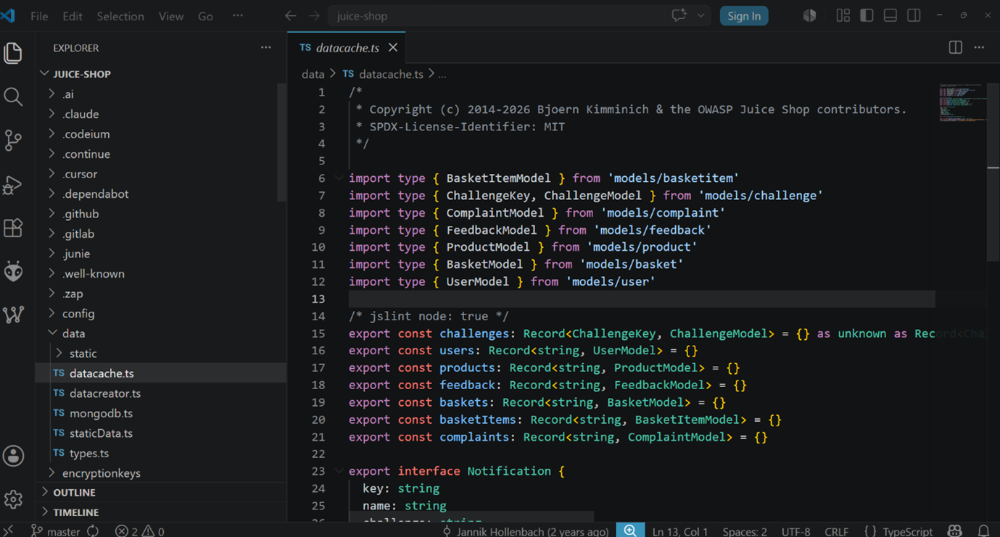

2. **Налаштування секретів:** Для безпечної авторизації до GitHub Secrets було додано токен доступу `SONAR_TOKEN`.

   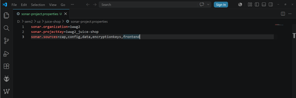

3. **Створення CI/CD Workflow:** Було написано конфігураційний файл `.github/workflows/sast.yml` для автоматичного запуску сканування під час подій `push` та `pull_request` у гілку `main`.

   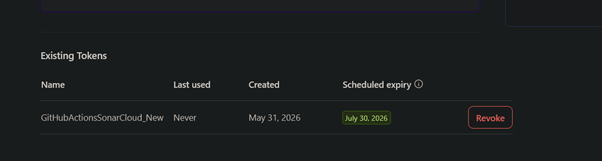
   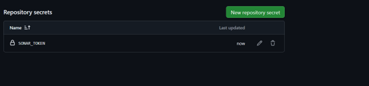

**Лістинг файлу автоматизації SAST:**
```yml
name: SAST

on:
  push:
    branches:
      - main
  pull_request:
    branches:
      - main

env:
  NODE_DEFAULT_VERSION: 20
  ANGULAR_CLI_VERSION: 17

jobs:
  sonarcloud:
    runs-on: ubuntu-latest

    steps:
    - name: Checkout repository
      uses: actions/checkout@v4

    - name: Setup Node.js
      uses: actions/setup-node@v4
      with:
        node-version: ${{ env.NODE_DEFAULT_VERSION }}
        cache: npm

    - name: Install dependencies
      run: npm install --legacy-peer-deps --no-audit --no-fund --ignore-scripts

    - name: SonarCloud Scan
      uses: sonarsource/sonarcloud-github-action@v3
      env:
        SONAR_TOKEN: ${{ secrets.SONAR_TOKEN }}
```

4. **Аналіз результатів:** Після успішного відпрацювання pipeline, результати сканування були перевірені у вкладці Security GitHub та на дашборді SonarCloud.

   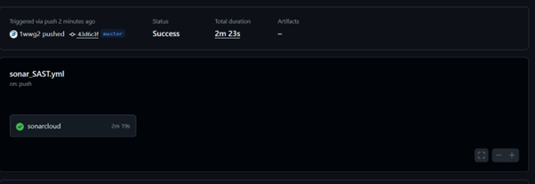
   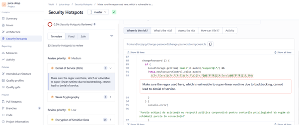

---

## Лабораторна робота №2: Аналіз залежностей (SCA) за допомогою Snyk

**Опис:** Впровадження Software Composition Analysis для перевірки всіх зовнішніх бібліотек та залежностей (npm-пакетів) на наявність відомих вразливостей (CVE).

### Хід виконання:
1. **Інтеграція зі Snyk:** Репозиторій було підключено до платформи Snyk для постійного моніторингу залежностей.

   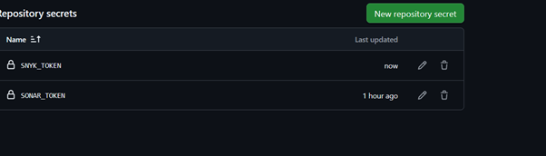

2. **Налаштування доступу:** Токен доступу `SNYK_TOKEN` успішно додано до GitHub Secrets.

   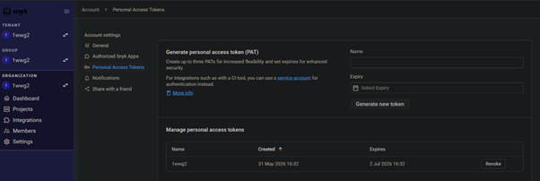

3. **Створення GitHub Actions Workflow:** Налаштовано конвеєр для автоматичної перевірки залежностей коду при змінах у репозиторії.

   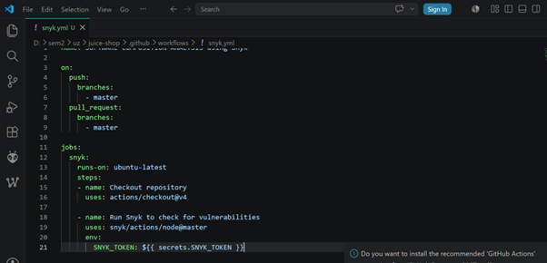
   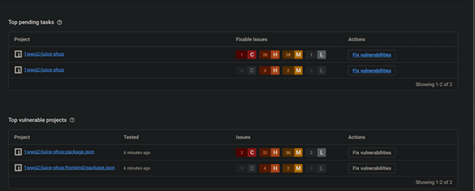

**Лістинг файлу автоматизації SCA:**
```yml
name: SOFTWARE COMPOSITION ANALYSIS using Snyk

on:
  push:
    branches:
      - main
  pull_request:
    branches:
      - main

jobs:
  snyk:
    runs-on: ubuntu-latest

    steps:
    - name: Checkout repository
      uses: actions/checkout@v4

    - name: Run Snyk to check for vulnerabilities
      uses: snyk/actions/node@master
      env:
        SNYK_TOKEN: ${{ secrets.SNYK_TOKEN }}
```

4. **Усунення вразливостей:** Під час сканування було виявлено ряд вразливостей у залежностях, після чого було застосовано відповідні патчі (фікси) для їх усунення.

   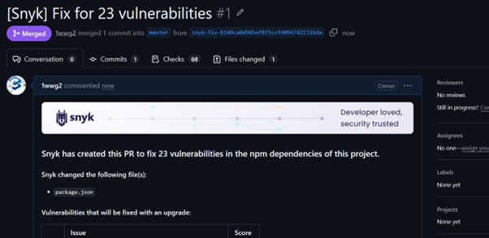
   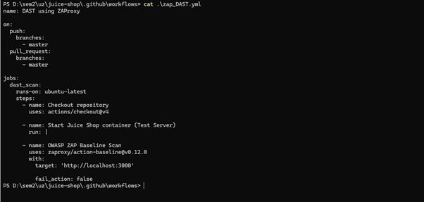

---

## Лабораторна робота №3: Налаштування DAST за допомогою OWASP ZAP

**Опис:** Виконання динамічного тестування безпеки (Dynamic Application Security Testing) розгорнутого вебзастосунку для виявлення вразливостей під час його роботи.

### Хід виконання:
1. **Налаштування ZAP у GitHub Actions:** Додано конфігурацію для автоматичного запуску контейнера ZAProxy. Сценарій налаштовано на базове сканування цільового URL демо-версії застосунку.

   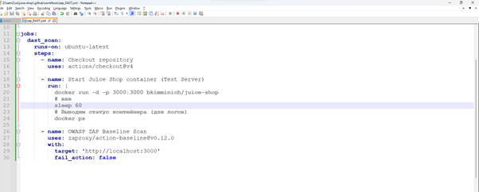

**Лістинг файлу автоматизації DAST:**
```yml
name: DAST

on:
  push:
    branches:
      - main
  pull_request:
    branches:
      - main
  workflow_dispatch:

permissions:
  pull-requests: write
  issues: write

jobs:
  zap_scan:
    runs-on: ubuntu-latest
    name: Scan the web application

    steps:
      - name: Checkout repository
        uses: actions/checkout@v4
        
      - name: ZAP Scan
        uses: zaproxy/action-baseline@v0.14.0
        with:
          target: '[https://demo.owasp-juice.shop](https://demo.owasp-juice.shop)'
          cmd_options: '-a'
```

2. **Отримання та аналіз звітів:** Після завершення роботи DAST-сканера було згенеровано детальні звіти щодо знайдених вразливостей конфігурації сервера та HTTP-заголовків.

   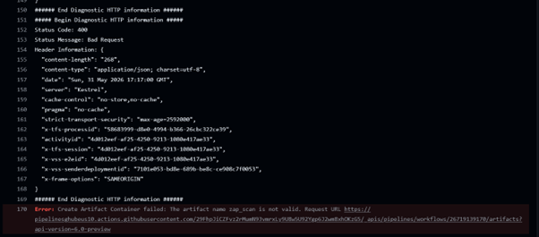
   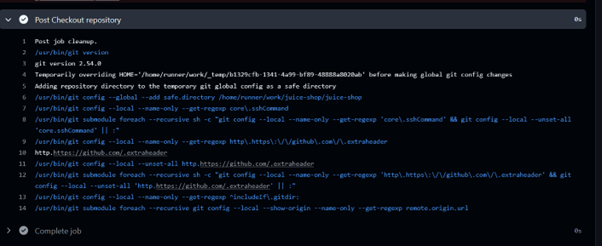
   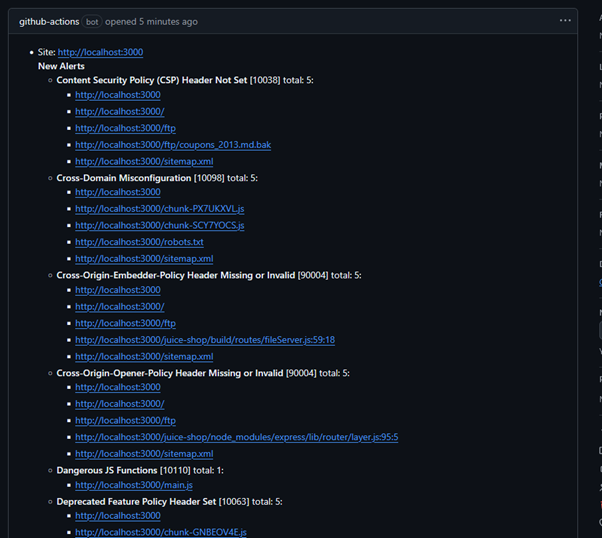

---

## Висновки та очікувані результати

1. **Автоматизація процесів безпеки:** Успішно впроваджено практики DevSecOps. Тепер усі етапи перевірки безпеки (SAST, SCA, DAST) виконуються автоматично в рамках єдиного CI/CD циклу на базі GitHub Actions.
2. **Звітування та моніторинг:** Налаштовано автоматичне генерування звітів про вразливості з їх подальшою візуалізацією у вкладці GitHub Security, SonarCloud та Snyk.
3. **Покращення безпеки:** Завдяки ранньому виявленню (Shift-Left Security) значно знижено ризик потрапляння вразливого коду або небезпечних залежностей у production-середовище.

---

## Лабораторна робота №4: Впровадження розширеного Secure SDLC Pipeline та експорт артефактів для SIEM (Wazuh)

**Опис:** Розробка та розгортання комплексного конвеєра DevSecOps, що включає сканування репозиторію на наявність витоку секретів (Gitleaks), аналіз вразливостей (Trivy) та автоматичну генерацію звітів (артефактів) для подальшої інтеграції із SIEM-системою (Wazuh).

### Хід виконання:

1. **Створення розширеного Workflow:** У директорії репозиторію `.github/workflows/` було створено новий файл конфігурації `secure-sdlc-pipeline.yml`. Пайплайн налаштовано на виконання багатоетапної перевірки безпеки коду та інфраструктури.

   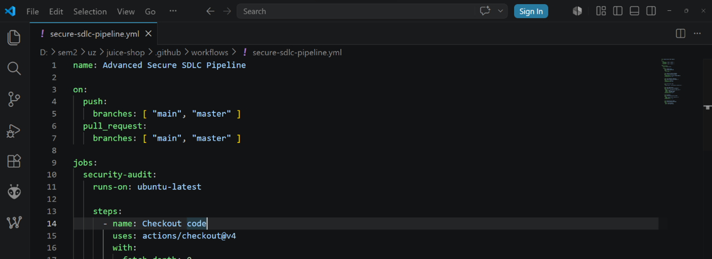

2. **Запуск конвеєра та тестування блокування збірки:** Під час запуску пайплайну процес очікувано завершився з помилкою (Fail) на етапах перевірки Gitleaks/Trivy. Це демонструє абсолютно коректну роботу сек'юріті-пайплайну: система автоматично блокує подальшу збірку (CI/CD) у разі виявлення критичних вразливостей або хардкод-секретів (що є характерним для тестового застосунку Juice Shop).

   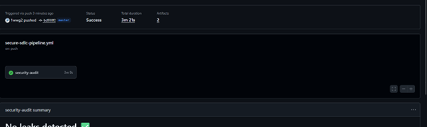

3. **Модифікація пайплайну для отримання звітів:** Для того, щоб конвеєр міг сформувати та зберегти звіт незалежно від статусу перевірки безпеки, до проблемних кроків було додано умову ігнорування блокування (директива `continue-on-error: true`). Це дозволило системі успішно дійти до фінального етапу.

   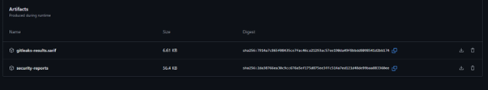

4. **Експорт артефактів безпеки:** Після завершення роботи GitHub Actions, на сторінці запуску в розділі **Artifacts** було автоматично збережено архів `security-reports`. Цей архів містить згенерований файл `trivy-report.json`, який повністю підготовлений для передачі та подальшого аналізу в системі моніторингу безпеки (Wazuh).

   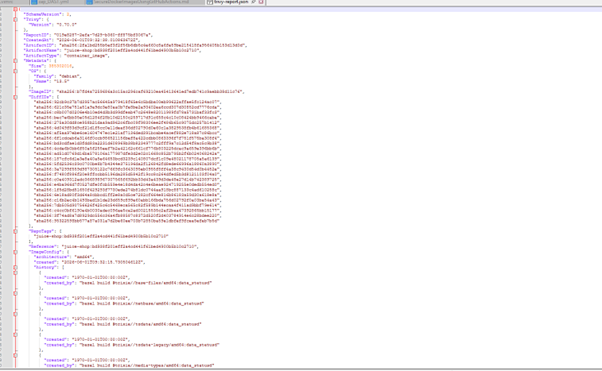

### Висновок до лабораторної роботи №4
Було успішно реалізовано концепцію "Secure SDLC". Налаштований пайплайн не лише виявляє вразливості та витоки даних, але й здатен зупиняти розгортання небезпечного коду. Крім того, налаштовано автоматичну підготовку форматованих даних для зовнішніх систем моніторингу (SIEM), що є важливим кроком у побудові зрілої інфраструктури безпеки.